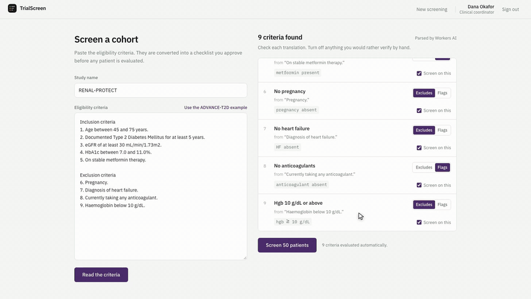
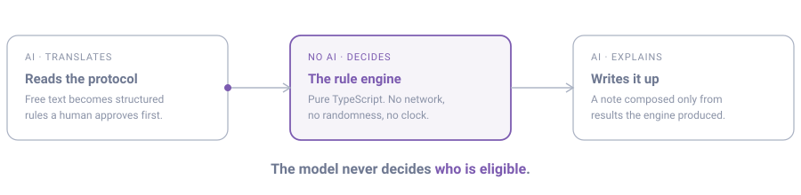
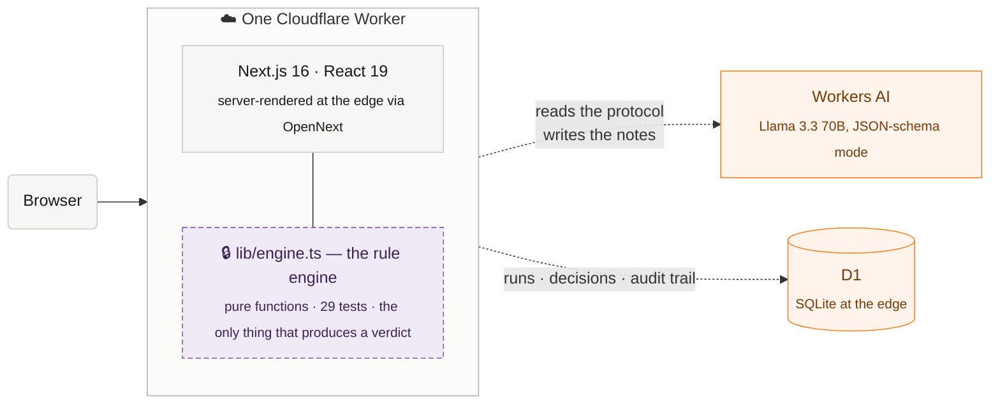

<div align="center">

# TrialScreen

### Eligibility screening that shows its working.

Finding patients is the step that makes clinical trials run late.
This screens a cohort in **114 milliseconds** — and shows the evidence behind every verdict.

[](LICENSE)
[](https://nextjs.org)
[](https://developers.cloudflare.com/workers-ai/)
[](lib/engine.test.ts)
[](scripts/generate-cohort.mjs)

</div>

<br>



<div align="center"><sub>Nine criteria parsed from free text, 50 patients screened, in real time.</sub></div><br>

## ▶ Watch the 6-minute narrated walkthrough

https://github.com/user-attachments/assets/cd841217-ad4a-41e0-a54b-212fc0350769


---

## The problem

A protocol carries 20 to 50 eligibility criteria. To screen one patient, a coordinator opens
the chart and checks it against every one of them, by hand. Then the next patient. A site
spends weeks getting to a cohort, and recruitment is the largest single reason trials miss
their timelines.

AI has been pointed at this before. The models are good enough. What comes out is the
problem: a verdict with nothing behind it. A regulator cannot inspect a probability, and an
investigator will not enrol a patient on reasoning they are not allowed to check. So the
tools stay in pilot.

## The idea

Split the job in three, and let only the deterministic part decide.



The model translates English into rules at the front and results back into English at the
end. Everything in between is arithmetic you can re-derive by hand — `lib/engine.ts` is pure
functions with no network, no randomness and no ambient clock.

## What a verdict looks like

Three outcomes, and the distinction between them is the whole product.


**Absence of evidence is never evidence of absence.** A missing lab result raises a question;
it never disqualifies anyone. Nor does a value that is in range but drawn outside the
protocol window — that comes back flagged, with the day count.

## What a run produces



A flagged patient is not a dead end. The reviewer accepts, excludes, or asks for more
information; the decision is stored against their name and a timestamp, moves the patient
between buckets, and **never rewrites the evidence underneath**. A human can override the
outcome. Nobody can rewrite the record.

---

## Run it

```bash
npm install
npm run db:migrate:local   # local D1 database, seeds the two demo accounts
npm run dev                # http://localhost:3000
```

Sign in with either persona — password `demo1234`:

| Account | Role | Sees |
| --- | --- | --- |
| `coordinator@trialscreen.demo` | Clinical coordinator | Screening and the review queue |
| `lead@trialscreen.demo` | Trial lead | The above, plus the audit log |

Then **Use the ADVANCE-T2D example → Read the criteria → Screen 50 patients.**

Workers AI runs against Cloudflare even in local dev, so `npx wrangler login` first. Without
it the app still works — criteria fall back to the local parser and the UI says so.

```bash
npm test     # 29 assertions over the rule engine — the file that backs the trust claim
npm run lint
```

## Architecture



The trust boundary is not a policy document you promise to follow. It is a module — the only
code in the system allowed to produce a verdict, and it has no way to reach the network.

| Concern | Choice |
| --- | --- |
| Framework | Next.js 16 App Router on Cloudflare Workers via `@opennextjs/cloudflare` |
| AI | Workers AI binding, `@cf/meta/llama-3.3-70b-instruct-fp8-fast`, JSON-schema mode |
| Database | D1 — demo accounts, the screening-run audit trail, reviewer decisions |
| Styling | Tailwind v4, design tokens only, IBM Plex Sans/Mono |
| Tests | `node:test` over the rule engine |

## Where the interesting decisions are

<details>
<summary><b>Every criterion is read twice — and it caught two real bugs</b></summary>
<br>

Workers AI and a local deterministic parser both read each criterion. Where the two readings
imply different cohorts, the checklist row turns amber, shows both, and makes a human choose.

Two defects this caught during development, both silent:

- **An exclusion read backwards.** *"Haemoglobin below 10 g/dL"* became `hgb ≤ 10`, which
  would have excluded 49 of 50 otherwise-eligible patients.
- **A dropped duration.** *"for at least 5 years"* quietly became a presence check, admitting
  patients the protocol excludes.

Two invariants are now enforced in code rather than asked of the model, because it got both
wrong repeatedly: inclusion vs exclusion comes from the protocol's own headings, and a rule
derived from an exclusion can never require the patient to *have* the disqualifying thing.

</details>

<details>
<summary><b>The engine's rules, in the order that matters</b></summary>
<br>

- A **hard** criterion that fails excludes. A **review** criterion only flags — concomitant
  medication rules are a clinician's call, not a parser's.
- **Missing data flags, never fails.** No HbA1c on the chart is an open question.
- **Stale data flags too**, with the day count and the protocol window.
- **Durations are computed** from the diagnosis date, never stored.
- **Drugs match on class**, so "no anticoagulants" catches Apixaban as well as Warfarin, and a
  discontinued one flags for washout rather than passing silently.
- Anything the parser cannot map comes back `unmapped`, switched off, and listed for manual
  verification — never silently dropped.

</details>

<details>
<summary><b>Why the score is deliberately trivial</b></summary>
<br>

```
score = round(100 × (passed + 0.5 × flagged) / criteria)
```

No weights, no model, no calibration. The UI prints the working next to the number, so when
someone asks how it was computed, the answer is already on screen.

</details>

<details>
<summary><b>Parsing one criterion at a time, in parallel</b></summary>
<br>

One large constrained decode takes about 33 seconds and fails as a unit. Twelve small ones
take about four and fail independently, so an unreadable line costs one line. When Workers AI
is unreachable entirely, `lib/parse-local.ts` takes over with a visible notice — the demo
degrades honestly instead of dying.

</details>

## Repository map

| Path | What's in it |
| --- | --- |
| `lib/engine.ts` | The deterministic core. Start here. |
| `lib/parse.ts` | AI parsing, the dual-parse cross-check, the enforced invariants |
| `lib/engine.test.ts` | 29 assertions — the file that backs the trust claim |
| `lib/patients.ts` | 50 seeded synthetic patients, 11 hand-authored edge cases |
| `app/`, `components/` | The screening, review and audit interfaces |
| `deck/` | The pitch deck and the video pipeline that renders it |

## Not in scope

Real EHR/FHIR ingestion, patient upload, self-service signup, multi-site trials, criterion
weighting. Production next steps, not prototype scope.

## Licence

MIT — see [LICENSE](LICENSE).

The synthetic cohort in `lib/patients.ts` is generated by `scripts/generate-cohort.mjs` from
a fixed seed. It is not derived from, and does not reconstruct, any real patient record.
